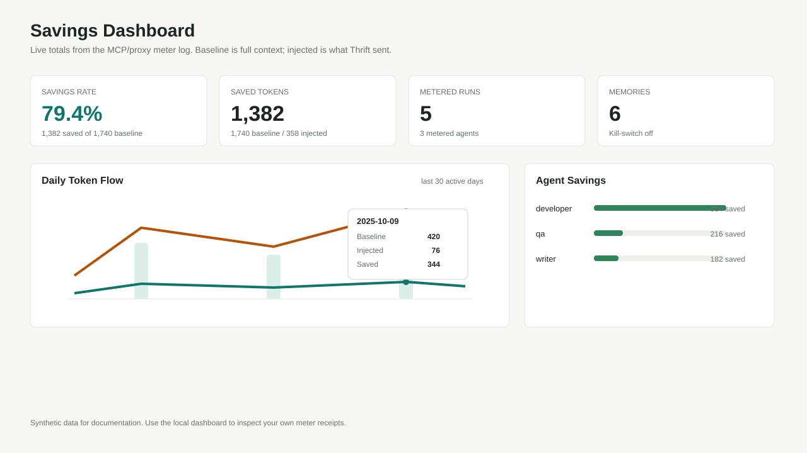

# Thrift Memory

**Cost-first memory for AI agent teams.** (npm: [`thrift-memory`](https://www.npmjs.com/package/thrift-memory))

> Not affiliated with [Apache Thrift](https://thrift.apache.org/), the RPC framework.
> This is an MCP memory layer for AI agents.

Thrift Memory gives MCP-capable agents a small shared memory layer that optimizes
for cost visibility: store memories cheaply, recall only the relevant slice under a
hard token budget, and log a receipt for every recall.

```text
savedTokens = baselineTokens - injectedTokens
```

The goal is practical: help teams of agents stop paying to reload the same broad
context on every run.

> Status: early `0.0.x`. APIs are useful but still allowed to change before
> `v0.1`.

## What It Does

Thrift has three surfaces:

| Surface | Purpose |
| --- | --- |
| MCP server | Agent memory tools: `remember`, `recall`, `search_memory` |
| Local dashboard | Savings UI backed by the meter JSONL, plus owner controls (pin/disable, budgets, kill-switch) |
| Proxy | Optional HTTP gateway that trims live LLM requests and retries rate limits |

Be precise about the split:

- **MCP manages memory recall and token receipts.**
- **`thrift-proxy` manages live request trimming and rate-limit retries.**

## How It Compares

Mature memory layers — [Mem0](https://github.com/mem0ai/mem0), [Zep](https://www.getzep.com/),
[Letta](https://www.letta.com/), [Cognee](https://www.cognee.ai/) — optimize **recall
quality**: LLM-enriched writes, temporal or entity knowledge graphs, deep
personalization. They are excellent at that, and far more battle-tested than this
project. Thrift Memory does not try to beat them on recall depth.

Thrift optimizes a different axis: **cost, locally, with proof.** The tradeoffs:

| | Thrift Memory | Quality-first layers (Mem0 / Zep / Letta / Cognee) |
| --- | --- | --- |
| Primary goal | Cut & **prove** token cost (budget + savings receipt) | Maximize recall quality / reasoning |
| Write path | Cheap — no mandatory LLM enrichment | Often LLM extraction/embedding on write |
| Install | `npx thrift-memory` — one dependency, local JSONL, **no API key, no DB, no Docker** | Typically an LLM key + a vector/graph DB (e.g. Mem0 self-host: API + Postgres/pgvector + Neo4j) |
| Dashboard | **Token-savings meter** + owner controls, local & read/write | Memory/agent-management UIs (several have one; different purpose) |
| Recall depth | Scoped match under a hard token budget | Knowledge-graph / temporal / semantic ranking |
| Maturity | Early `0.0.x` | Production-grade, widely adopted |

Honest summary: if you need the smartest possible recall, use one of the others.
If you run a **fleet of agents** that keep re-paying to reload broad context and you
want to **measure and cap that cost** with no extra infrastructure, that gap is what
Thrift fills. The two are not mutually exclusive — Thrift can sit in front of a
heavier store as the budget/metering layer.

## MCP Tools

```text
remember(scope, text, agentId?, sessionId?, tags?)
  Store a memory in org, agent, or session scope.

recall(agentId, tokenBudget, task?, tags?)
  Return relevant memories under a hard token budget.
  Also returns { injectedTokens, baselineTokens, savedTokens }.

search_memory(agentId, task?, tags?, limit?)
  Browse matching memories without applying a small recall budget.
```

## Quick Start

```bash
npm install -g thrift-memory
```

Add Thrift to an MCP-capable client:

```json
{
  "mcpServers": {
    "thrift": {
      "command": "npx",
      "args": ["thrift-memory"]
    }
  }
}
```

Or run the MCP server directly:

```bash
npx thrift-memory \
  --store-path=~/.thrift/memories.jsonl \
  --meter-path=~/.thrift/meter.jsonl \
  --default-budget=2000
```

## 60-Second Demo

No agent required — prove the `remember → recall → receipt` loop with the library.
Save as `demo.mjs` after `npm install thrift-memory`, then `node demo.mjs`:

```js
import { JsonlStore, ScopedRetriever } from "thrift-memory";

const store = new JsonlStore({ path: "./demo.jsonl" });
const now = Date.now();

// 1. remember — store a few org memories (cheap, no LLM enrichment)
store.add({ scope: "org", text: "All money values are stored as integer cents, never floats." }, now);
store.add({ scope: "org", text: "We deploy only on green CI; no Friday-evening releases." }, now);
store.add({ scope: "org", text: "Postgres is the system of record; Redis is cache-only." }, now);

// 2. recall — load only what the task needs, under a hard token budget
const r = new ScopedRetriever().recall(store, {
  agentId: "dev",
  task: "how should I store currency amounts?",
  tokenBudget: 40,
});

// 3. receipt
for (const m of r.memories) console.log("•", m.text);
console.log(`injected ${r.injectedTokens} / baseline ${r.baselineTokens} (saved ${r.savedTokens})`);
```

```text
• All money values are stored as integer cents, never floats.
• We deploy only on green CI; no Friday-evening releases.
injected 29 / baseline 43 (saved 14)
```

The third memory was dropped because it didn't fit the 40-token budget — that gap
(`baseline - injected`) is exactly what you stop paying for on every run.

## Dashboard

The optional dashboard is local. It shows whether Thrift is really saving tokens
across real agent runs, and (as of 0.0.3) exposes a small write surface for owner
controls — pin/disable a memory, set per-agent budgets, mute an agent, and a
fleet-wide kill-switch — over local `POST`/`DELETE` endpoints. The same controls
are available from the `thrift-panel` CLI.

```bash
npx thrift-panel serve \
  --store-path=~/.thrift/memories.jsonl \
  --meter-path=~/.thrift/meter.jsonl \
  --control-path=~/.thrift/control.json \
  --port=8585
```

Open `http://127.0.0.1:8585`.



The dashboard shows:

| View | What it proves |
| --- | --- |
| Fleet summary | Total baseline, injected, saved tokens, and savings rate |
| Daily token flow | Whether savings persist across real days |
| Agent savings | Which agents are expensive and which save the most |
| Recent receipts | The latest metered recall/proxy events |
| Audit paths | The local files backing the numbers |

CLI equivalents:

```bash
npx thrift-panel summary --store-path=~/.thrift/memories.jsonl --meter-path=~/.thrift/meter.jsonl
npx thrift-panel agents --store-path=~/.thrift/memories.jsonl --meter-path=~/.thrift/meter.jsonl
npx thrift-panel memories --store-path=~/.thrift/memories.jsonl --scope=org
```

## Measuring Performance

Every `recall` writes a receipt to `THRIFT_METER_PATH` when a meter path is
configured:

```json
{"at":1760000000000,"agentId":"dev","injectedTokens":420,"baselineTokens":2100,"savedTokens":1680}
```

Definitions:

| Field | Meaning |
| --- | --- |
| `baselineTokens` | The no-Thrift counterfactual: all in-scope memory that would have been loaded |
| `injectedTokens` | The slice Thrift actually returned under budget |
| `savedTokens` | `baselineTokens - injectedTokens` |
| Savings rate | `savedTokens / baselineTokens` |

Recommended measurement loop:

1. Seed memories from your own markdown files or use `remember`.
2. Let real agents call `recall` during normal work.
3. Review `thrift-panel summary` and `thrift-panel agents`.
4. Validate quality separately by comparing task outcomes with full memory vs
   Thrift recall.

For a credible public report, publish both token reduction and quality evidence.
For example: "saved 72% of memory tokens across 200 real recalls, with 19/20
paired tasks producing the same outcome."

> **Account for the MCP overhead.** Registering any MCP server adds its tool-schema
> load to each agent's context (often several thousand tokens). The honest figure is
> **net**: `savings = recall reduction − MCP schema/tool-call overhead`. On a
> context-heavy agent that reloads broad memory every run, recall usually wins by a
> wide margin — but confirm it with the meter on your own workload before going
> fleet-wide, rather than assuming. The receipts exist precisely so you don't have to
> guess.

## Synthetic Benchmark

This repo includes a small synthetic fixture so users can verify the measurement
pipeline without any private data:

```bash
npm run build
node benchmark/run.mjs
```

It reads:

- `benchmark/fixtures/memories.jsonl`
- `benchmark/fixtures/meter.jsonl`

See [docs/case-study.md](./docs/case-study.md) for a sanitized example of how to
interpret the numbers.

## Proxy And Rate Limits

The proxy is optional. Use it when an agent can point its LLM `base_url` at a
local HTTP gateway.

> **Security — run it locally only.** The proxy forwards your real provider API
> key upstream unchanged. Bind it to `127.0.0.1` (the default) and never expose it
> on a public interface or share the port. It is a single-tenant developer tool, not
> a hardened multi-tenant gateway. Responses are also buffered, so SSE streaming is
> not passed through yet.

```bash
npx thrift-proxy \
  --upstream=https://api.anthropic.com \
  --port=8787 \
  --budget=4000 \
  --meter-path=~/.thrift/meter.jsonl
```

Then configure the agent's LLM base URL as `http://localhost:8787` and keep using
the real provider API key.

The proxy:

- trims live request context under a hard token budget,
- writes the same savings receipts as the MCP surface,
- retries upstream `429` and `503 Retry-After` responses,
- throttles concurrent upstream requests per provider.

Rate-limit defaults:

| Setting | Default | Env var |
| --- | ---: | --- |
| Max concurrency | `5` | `THRIFT_MAX_CONCURRENCY` |
| Max retries | `5` | `THRIFT_MAX_RETRIES` |
| Backoff base | `1000ms` | `THRIFT_BACKOFF_BASE_MS` |
| Max backoff | `60000ms` | `THRIFT_MAX_BACKOFF_MS` |

`thrift-proxy` buffers responses in this version; streaming passthrough is a
future improvement.

## Import Existing Memories

The import script is generic and local-only. It can import markdown files into a
JSONL store:

```bash
node scripts/import-memories.mjs \
  --source=./memory \
  --scope=org \
  --store-path=~/.thrift/memories.jsonl \
  --dry-run
```

For agent-scoped memories, put markdown files under project directories and use
`--scope=agent`:

```text
memory/
  checkout-service/
    dev.md
    qa.md
  docs-site/
    writer.md
```

```bash
node scripts/import-memories.mjs --source=./memory --scope=agent
```

## Library Usage

```ts
import { JsonlStore, ScopedRetriever, InMemoryMeter, ThriftMcpServer } from "thrift-memory";

const server = new ThriftMcpServer({
  store: new JsonlStore({ path: "./memories.jsonl" }),
  retriever: new ScopedRetriever(),
  meter: new InMemoryMeter(),
  defaultTokenBudget: 2000,
});

await server.runStdio();
```

## Development

```bash
npm install
npm run typecheck
npm run build
npm test
```

## Layout

| Path | Purpose |
| --- | --- |
| `src/mcp/` | MCP stdio server and tool definitions |
| `src/store/` | JSONL memory store |
| `src/retrieval/` | Scoped budget-bounded recall |
| `src/meter/` | Token meter and rollups |
| `src/control/` | CLI and local dashboard |
| `src/proxy/` | HTTP proxy, context trimming, rate-limit retries |
| `benchmark/fixtures/` | Synthetic public benchmark data |
| `docs/` | Public docs, screenshot, sanitized case study |
| `test/` | Unit and integration tests |

## License

[Apache-2.0](./LICENSE)
